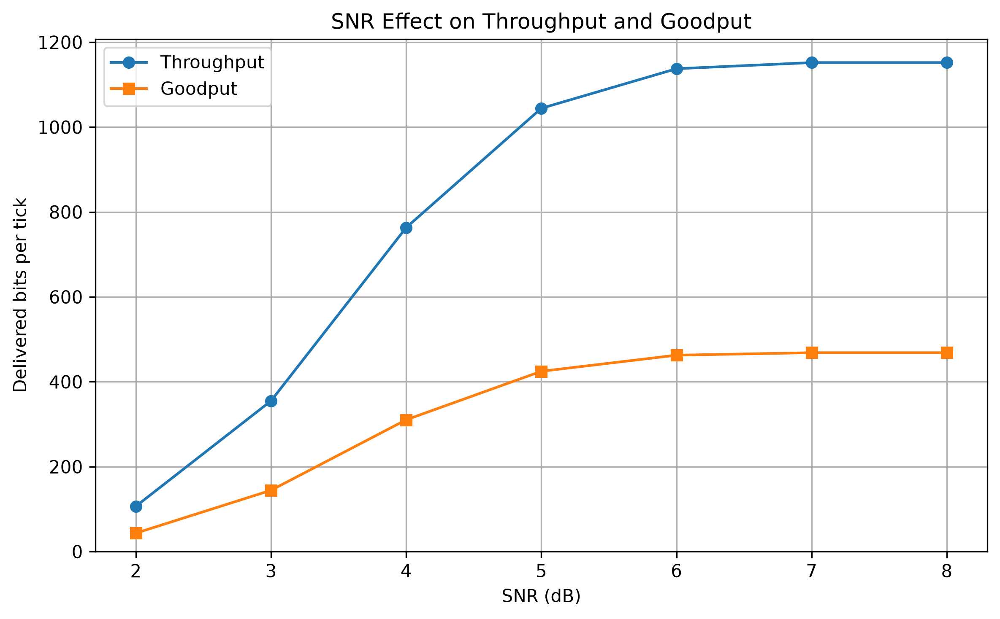
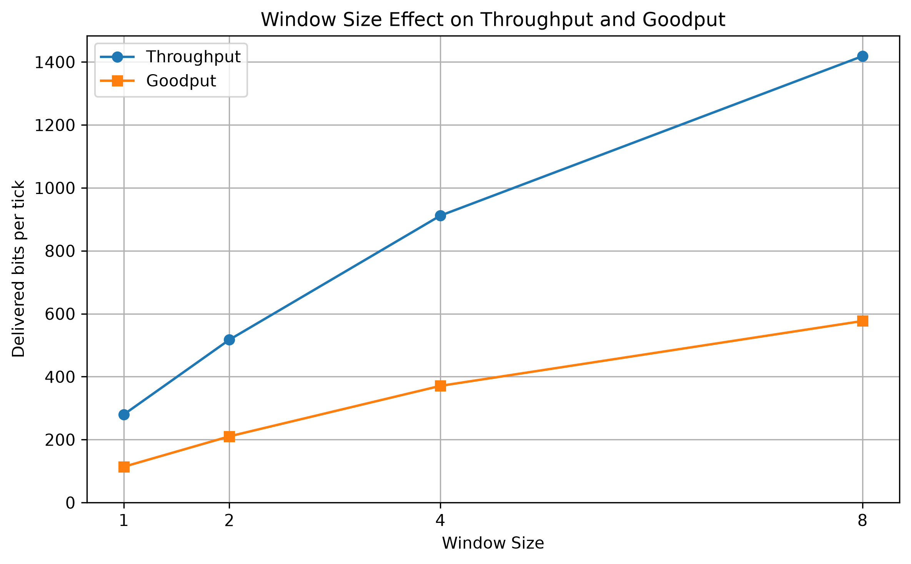

# End-to-End Network Simulator

A Python-based simulation of an end-to-end communication system that integrates **Data Link Layer** and **Physical Layer** mechanisms over wired and wireless noisy channels.

The simulator models the complete transmission path from the sender to the receiver, including framing, error detection and correction, Selective Repeat ARQ, line coding and digital modulation, noisy-channel transmission, encryption, performance analysis, and real-time visualization.


---

## Overview

This project simulates a complete layered communication system in which raw input data passes through both the **Data Link Layer** and the **Physical Layer** before reaching the destination.

The sender prepares and protects the data, converts it into a suitable physical representation, and transmits it through a noisy communication channel. The receiver performs the reverse operations, detects and corrects transmission errors, requests retransmissions when necessary, reconstructs the original data, and finally decrypts it.

Two communication environments are supported:

| Channel | Techniques | Channel Model |
| --- | --- | --- |
| Wired | B8ZS, HDB3 | Additive signal noise and level detection |
| Wireless | BPSK, 16-QAM | Additive White Gaussian Noise (AWGN) |

Reliability is provided through three complementary mechanisms:

- **Hamming (12,8)** for forward error correction
- **CRC-32** for detection of remaining corrupted frames
- **Selective Repeat ARQ** for retransmission of lost or rejected frames

The simulator supports both **text messages** and **arbitrary files**, allowing the same communication pipeline to operate on different types of binary data.

---

# End-to-End Pipeline

The complete transmission process is shown below.

```text
Input Data
(Text / File)
    |
    v
XOR Encryption
    |
    v
Fragmentation
    |
    v
Frame Construction
[Sequence Number | Payload | CRC-32]
    |
    v
Byte Stuffing + Frame Flags
    |
    v
Hamming (12,8) Encoding
    |
    v
Selective Repeat Sender
    |
    +---------------------------------------+---------------------------------------+
    |                                                                               |
    v                                                                               v
Wired Transmission                                                        Wireless Transmission
    |                                                                               |
    v                                                                               v
B8ZS / HDB3                                                              BPSK / 16-QAM
Line Coding                                                               Modulation
    |                                                                               |
    v                                                                               v
Additive Signal Noise                                                       AWGN Channel
    |                                                                               |
    v                                                                               v
Level Detection                                                         Demodulation / Detection
    |                                                                               |
    +---------------------------------------+---------------------------------------+
                                            |
                                            v
                                  Physical-Layer Output
                                            |
                                            v
                                  Hamming (12,8) Decoding
                                            |
                                            v
                                      Byte Unstuffing
                                            |
                                            v
                                       CRC Validation
                                            |
                                            v
                                  +-------------------+
                                  |   Frame Valid?    |
                                  +---------+---------+
                                            |
                              +-------------+-------------+
                              |                           |
                             Yes                          No
                              |                           |
                              v                           v
                         Accept Frame                Reject Frame
                         Send ACK                    NAK / Timeout
                              |                           |
                              |                           v
                              |                 Selective Retransmission
                              |                           |
                              |                           |
                              +-------------+-------------+
                                            |
                                            v
                                Selective Repeat Receiver
                                  [Buffer + Reordering]
                                            |
                                            v
                                  +---------------------+
                                  | All Frames Received?|
                                  +----------+----------+
                                             |
                                +------------+------------+
                                |                         |
                               No                        Yes
                                |                         |
                                v                         v
                     Wait for Missing Frames       Frame Reassembly
                                                          |
                                                          v
                                                   XOR Decryption
                                                          |
                                                          v
                                                   Recovered Data
```

### Pipeline Summary

The transmission begins with the original text or file being converted into raw bytes. If encryption is enabled, the complete input is encrypted before entering the framing process.

The encrypted byte stream is divided into smaller payloads. Each payload is placed inside a frame with a sequence number and CRC-32 information. Byte stuffing is then used to prevent payload bytes from being confused with frame-delimiting flag bytes.

Before transmission, the frame is protected using **Hamming (12,8)** coding.

The encoded data is then passed to the selected physical transmission method:

- **B8ZS or HDB3** for the wired channel
- **BPSK or 16-QAM** for the wireless channel

The channel introduces noise into the transmitted signal. The receiver detects or demodulates the received signal and reconstructs the transmitted bit stream.

Hamming decoding attempts to correct single-bit errors. CRC-32 is then used to determine whether the recovered frame is still corrupted.

Valid frames are acknowledged and buffered by the Selective Repeat receiver. Invalid or lost frames are retransmitted after a NAK or timeout.

Once every frame has been received successfully, frames are reordered, reassembled, decrypted, and returned as the recovered output.

---

## Features

### Data Link Layer

The Data Link Layer is responsible for converting the original byte stream into independently manageable frames.

Implemented mechanisms include:

- Configurable data fragmentation
- Sequence-numbered frames
- Header, payload, and trailer structure
- HDLC-style frame boundaries
- `0x7E` frame flags
- `0x7D` escape bytes
- Byte stuffing and unstuffing
- CRC-32 generation and verification
- Frame serialization and reconstruction
- Final frame reassembly

---

## Error Control

The simulator combines **Forward Error Correction** and **error detection** instead of relying on a single mechanism.

### Hamming (12,8)

Every 8-bit data block is encoded into a 12-bit Hamming block.

The receiver uses the redundant parity information to:

- Detect single-bit errors
- Identify the corrupted bit position
- Correct the error before CRC validation

Hamming correction reduces the number of frames that need to be retransmitted when the channel introduces small errors.

### CRC-32

Hamming coding cannot guarantee recovery from every possible multi-bit error.

For this reason, each frame is also protected by **CRC-32**.

After Hamming decoding, the receiver verifies the CRC:

```text
CRC Valid
    |
    +--> Frame accepted
    |
CRC Invalid
    |
    +--> Frame rejected
         |
         +--> NAK / Timeout
              |
              +--> Retransmission
```

This allows Hamming to handle correctable errors while CRC detects remaining corruption.

---

## Selective Repeat ARQ

The project implements the **Selective Repeat Automatic Repeat reQuest** protocol for reliable frame delivery.

Unlike Stop-and-Wait, Selective Repeat allows several frames to be transmitted before waiting for individual acknowledgements.

### Sliding Window

The sender maintains a configurable transmission window containing multiple outstanding frames.

For example:

```text
Window Size = 4

+---------+---------+---------+---------+
| Frame 0 | Frame 1 | Frame 2 | Frame 3 |
+---------+---------+---------+---------+
                         |
                         v

ACK 0
ACK 1
NAK 2
ACK 3

                         |
                         v

Only Frame 2 is retransmitted
```

Once frames at the beginning of the window are acknowledged, the window moves forward and new frames can be transmitted.

### ACK and NAK

The receiver sends:

- **ACK** for successfully received frames
- **NAK** when a transmitted frame is detected as corrupted

### Timeout

Each transmitted frame has an independent timeout.

If an acknowledgement is not received before its timer expires, that specific frame is retransmitted.

### Selective Retransmission

Only the affected frame is sent again.

Other correctly received frames are preserved in the receiver buffer instead of being retransmitted unnecessarily.

This behavior makes Selective Repeat more efficient than protocols that resend an entire window after an error.

---

## Wired Channel

The simulator provides two bipolar line-coding techniques.

### B8ZS

**Bipolar with 8-Zero Substitution** replaces long sequences of eight consecutive zero bits with a predefined bipolar violation pattern.

This helps maintain synchronization while avoiding long periods without signal transitions.

### HDB3

**High Density Bipolar of Order 3** replaces sequences of four consecutive zero bits using substitution patterns that depend on the number and polarity of previous pulses.

The implementation preserves the bipolar characteristics required by the coding scheme.

### Wired Noise

After line coding, additive noise is applied directly to the transmitted signal.

The receiver then performs level detection to determine the most likely transmitted bipolar symbols before decoding the line code.

---

## Wireless Channel

Wireless transmission requires conversion of digital bits into modulated waveforms.

The simulator provides two modulation techniques.

### BPSK

**Binary Phase Shift Keying** represents binary values using two opposite signal phases.

The receiver performs correlation-based detection to determine the transmitted bit.

BPSK offers good noise resistance and is used by the performance analysis module to study the effect of SNR.

### 16-QAM

**16-Quadrature Amplitude Modulation** represents four bits per symbol using combinations of in-phase and quadrature amplitudes.

Compared with BPSK, 16-QAM can represent more bits per transmitted symbol but requires more reliable signal detection.

### AWGN Channel

Wireless noise is modeled using **Additive White Gaussian Noise**.

The amount of noise is determined using the configured **Signal-to-Noise Ratio (SNR)**.

Lower SNR values represent noisier transmission conditions, while higher SNR values represent cleaner channels.

---

## Security

The simulator includes optional encryption using a repeating-key XOR cipher.

Encryption is applied to the original input **before fragmentation and framing**:

```text
Original Data
     |
     v
Encryption
     |
     v
Framing
     |
     v
Transmission
```

At the destination, decryption is performed only after the complete frame sequence has been received and reconstructed:

```text
Received Frames
     |
     v
Validation
     |
     v
Reassembly
     |
     v
Decryption
     |
     v
Original Data
```

This ensures that the data carried by transmitted frames does not directly expose the original application-level content.

> XOR encryption is used as an educational component of the simulation and should not be considered production-grade cryptography.

---

## Input Support

The simulator supports:

- Text messages
- Images
- Binary files
- Documents
- Other arbitrary file formats

Files are processed as raw byte sequences, so the underlying communication mechanisms are independent of the actual file format.

After successful reception, file data can be reconstructed and written back to disk.

---

## Real-Time GUI

A graphical interface is provided using **CustomTkinter** and **Matplotlib**.

Run it with:

```bash
python gui.py
```

The GUI provides a live representation of the communication process, including:

- Sender sliding window
- Current frame states
- Frame sequence numbers
- Transmission attempts
- ACK events
- NAK events
- Timeout events
- Lost frames
- CRC failures
- Retransmissions
- Physical-layer transmitted signals
- Physical-layer received signals
- Transmission statistics
- Successfully recovered data

The GUI uses the same underlying simulation components as the command-line version.

---

# Performance Analysis

The performance module evaluates how physical-channel conditions and protocol parameters influence communication efficiency.

Two main metrics are measured:

### Throughput

Throughput represents the rate at which successfully delivered communication data is transferred during the simulation.

### Goodput

Goodput represents only the useful application-level data successfully delivered to the destination.

Protocol overhead is not counted as useful application data.

Because framing, CRC, Hamming redundancy, and retransmissions consume part of the communication capacity:

```text
Goodput < Throughput
```

under normal operating conditions.

Two experiments are implemented:

1. Effect of **SNR** on wireless BPSK performance
2. Effect of **Selective Repeat window size** on communication performance

Multiple simulation runs are performed for each configuration and the results are averaged to reduce random variations caused by channel noise.

---

## SNR Performance



This experiment evaluates wireless BPSK transmission for different SNR values.

### Results

| SNR (dB) | Throughput | Goodput |
| ---: | ---: | ---: |
| 2 | 106.82 | 43.47 |
| 3 | 355.10 | 144.43 |
| 4 | 763.35 | 310.49 |
| 5 | 1044.32 | 424.77 |
| 6 | 1137.60 | 462.71 |
| 7 | 1152.00 | 468.57 |
| 8 | 1152.00 | 468.57 |

### Analysis

At low SNR values, the received BPSK waveform contains a relatively large amount of noise compared with the useful signal.

This increases the probability of incorrect bit detection.

The error-control process can be summarized as:

```text
Low SNR
   |
   v
More Bit Errors
   |
   v
More Hamming Corrections
   |
   v
More Uncorrectable Frames
   |
   v
More CRC Failures
   |
   v
More Retransmissions
   |
   v
Lower Throughput / Goodput
```

At **2 dB**, the channel is highly unreliable. A significant portion of transmission time is spent dealing with corrupted frames and retransmissions, resulting in low throughput and goodput.

Between approximately **3 dB and 6 dB**, the improvement is substantial.

As SNR increases:

- Signal detection becomes more reliable
- The bit-error probability decreases
- More Hamming blocks can be recovered successfully
- Fewer frames fail CRC validation
- Selective Repeat performs fewer retransmissions
- Throughput and goodput increase rapidly

At approximately **7–8 dB**, both curves reach a plateau.

This represents the **saturation region** of the experiment.

Once channel errors become sufficiently rare, increasing SNR further cannot significantly improve performance because noise is no longer the primary limiting factor.

At this point, the maximum observed performance is mainly determined by factors such as:

- Frame structure
- Hamming redundancy
- CRC overhead
- Payload size
- Selective Repeat behavior
- Simulation timing model

The gap between throughput and goodput remains even at high SNR because only application payload contributes to goodput.

Additional protocol information must still be transmitted regardless of channel quality.

---

## Selective Repeat Window Size Performance



This experiment evaluates the effect of changing the Selective Repeat sender window while keeping the channel configuration fixed.

### Results

| Window Size | Throughput | Goodput |
| ---: | ---: | ---: |
| 1 | 279.84 | 113.82 |
| 2 | 517.38 | 210.44 |
| 4 | 911.84 | 370.89 |
| 8 | 1418.56 | 576.99 |

### Analysis

The Selective Repeat window determines how many frames can remain outstanding before acknowledgements force the sender to stop progressing.

With a window size of **1**, the protocol behaves similarly to Stop-and-Wait:

```text
Send Frame
    |
    v
Wait
    |
    v
Receive ACK
    |
    v
Send Next Frame
```

The sender spends a significant amount of time waiting instead of transmitting additional frames.

This leads to poor channel utilization.

With a larger window:

```text
Frame 0 ---->
Frame 1 ---->
Frame 2 ---->
Frame 3 ---->

         <---- ACK 0
         <---- ACK 1
         <---- ACK 2
         <---- ACK 3
```

multiple frames can remain in flight simultaneously.

This produces **pipelining**, which reduces idle transmission time.

As the window grows from:

```text
1 -> 2 -> 4 -> 8
```

both throughput and goodput increase significantly.

Another advantage of Selective Repeat is that a problem with one frame does not require retransmission of every frame in the current window.

For example:

```text
Frame 0 -> ACK
Frame 1 -> ACK
Frame 2 -> Lost
Frame 3 -> ACK

             |
             v

Retransmit Frame 2 only
```

This allows successfully delivered frames to continue contributing to receiver progress even when individual frames fail.

The measured results therefore demonstrate the expected relationship:

```text
Larger Window
      |
      v
More Frames In Flight
      |
      v
Less Sender Idle Time
      |
      v
Better Channel Utilization
      |
      v
Higher Throughput and Goodput
```

The tested values show strong performance improvement up to a window size of 8.

In a larger or more detailed simulation, the benefit would eventually be limited by channel capacity, receiver buffering, error rate, or other protocol constraints.

---

## Running Performance Experiments

Run:

```bash
python performance_main.py
```

The analysis automatically generates the performance plots under:

```text
docs/figures/
├── snr_performance.png
└── window_performance.png
```

---

# Project Structure

```text
.
├── main.py
├── gui.py
├── performance_main.py
├── requirements.txt
├── .gitignore
│
├── docs/
│   └── figures/
│       ├── snr_performance.png
│       └── window_performance.png
│
└── src/
    ├── channel.py
    ├── error_control.py
    ├── framing.py
    ├── line_coding.py
    ├── metrics.py
    ├── modulation.py
    ├── performance_analysis.py
    ├── security.py
    ├── selective_repeat.py
    ├── simulator.py
    └── utils.py
```

### Main Files

| File | Purpose |
| --- | --- |
| `main.py` | Interactive command-line simulator |
| `gui.py` | Real-time graphical simulator |
| `performance_main.py` | Entry point for performance experiments |
| `src/framing.py` | Fragmentation, framing and byte stuffing |
| `src/error_control.py` | Hamming coding and CRC-32 |
| `src/selective_repeat.py` | Selective Repeat ARQ |
| `src/line_coding.py` | B8ZS and HDB3 |
| `src/modulation.py` | BPSK and 16-QAM |
| `src/channel.py` | Wired noise and AWGN models |
| `src/simulator.py` | Physical transmission pipeline |
| `src/security.py` | XOR encryption and decryption |
| `src/metrics.py` | Performance metrics |
| `src/performance_analysis.py` | SNR and window-size experiments |
| `src/utils.py` | Byte, bit and file utilities |

---

# Installation

Clone the repository:

```bash
git clone https://github.com/arminfkh/end-to-end-network-simulator.git
cd end-to-end-network-simulator
```

Create a virtual environment:

```bash
python -m venv venv
```

### Linux / macOS

Activate it using:

```bash
source venv/bin/activate
```

### Windows

```powershell
venv\Scripts\activate
```

Install the required dependencies:

```bash
pip install -r requirements.txt
```

The main external dependencies are:

- NumPy
- Matplotlib
- CustomTkinter

Tkinter support must also be available in the local Python installation.

---

# Usage

## Command-Line Simulator

Run:

```bash
python main.py
```

The program interactively asks for the required transmission configuration.

Typical choices include:

```text
Input
 |
 +-- Text
 |
 +-- File

Channel
 |
 +-- Wired
 |    |
 |    +-- B8ZS
 |    +-- HDB3
 |
 +-- Wireless
      |
      +-- BPSK
      +-- 16-QAM
```

During the simulation, frame-level events such as ACKs, NAKs, retransmissions, error corrections, and transmission failures are printed to the terminal.

---

## Graphical Simulator

Run:

```bash
python gui.py
```

The graphical version can be used to configure and observe the transmission process visually.

---

## Performance Analysis

Run:

```bash
python performance_main.py
```

This executes the predefined experiments and regenerates the performance graphs.

---

# Configurable Parameters

The simulator exposes several parameters that can be modified to study different communication scenarios:

- Payload size
- Selective Repeat window size
- Timeout duration
- Maximum transmission attempts
- Frame-loss probability
- Wired-channel noise level
- Wireless SNR
- BPSK samples per bit
- Random seed

These parameters allow the same implementation to be tested under different channel and protocol conditions.

---

# Technologies

- **Python**
- **NumPy** — numerical operations and signal processing
- **Matplotlib** — waveform and performance visualization
- **Tkinter / CustomTkinter** — graphical user interface
- **zlib** — CRC-32 calculation

---

# Academic Context

This project was developed for a Computer Networks course as an educational implementation of an integrated Physical Layer and Data Link Layer communication system.

Its main purpose is to demonstrate how mechanisms from different network layers interact in a complete end-to-end transmission process, including:

- Physical signaling
- Noisy communication channels
- Framing
- Forward error correction
- Error detection
- Reliable retransmission
- Sliding-window protocols
- Encryption
- Performance evaluation